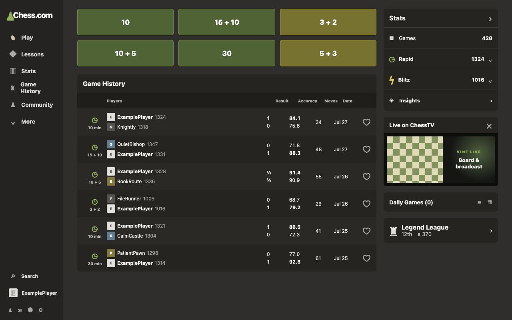

# ChessComVINF

ChessComVINF (Version Infinity) turns the signed-in Chess.com homepage into a
focused dashboard. It provides one-click matchmaking for six or eight configurable
clocks,
promotes Game History and Stats, and removes homepage modules that interrupt the
normal play workflow, including Chess.com's recurring top campaign banner and
redundant homepage avatar/username toolbar.



ChessComVINF is an independent, unofficial extension and is not affiliated with,
endorsed by, or sponsored by Chess.com.

The extension toolbar popup keeps its master `Enable VINF` switch in a standalone
top card. Its `Homepage` section can place Daily Games in the native main column,
the right column, or nowhere and independently hide ChessTV and Legend League.
The remaining sections choose a six- or eight-button Quick Play grid with unique
Bullet/Blitz/Rapid presets and control the visibility and fixed order of native
Stats rows. Every enabled rating row can start expanded or retracted
independently. Every change saves immediately to local browser storage; there is
no separate Save step.

Version 0.12 defaults the Stats card to one summary (`Games`), then retracted
`Rapid`, retracted `Blitz`, and the native `Insights` link.
Games/Puzzles/Lessons and the six native rating categories can all be shown,
hidden, reordered, and given their own initial expanded/retracted state; Insights
deliberately remains visible at the bottom.

The 17-control catalog is a desktop-first union of Chess.com's current web and
mobile presets:

- Bullet: `30 sec`, `20 sec + 1`, `1 min`, `1 + 1`, `2 + 1`.
- Blitz: `3 min`, `3 + 2`, `5 min`, `5 + 2`, `5 + 3`, `5 + 5`.
- Rapid: `10 min`, `10 + 5`, `15 + 10`, `20 min`, `30 min`, `60 min`.

The settings UI presents one unified Blitz group; source-platform differences
remain catalog metadata only. The original six defaults remain unchanged. The
eight-button default adds `1 + 1` and `3 min`, replaces `5 + 3` with `5 + 5`,
and fills two desktop rows as:

    10      15 + 10      1 + 1      3 + 2
    10 + 5  30           3          5 + 5

Quick Play shows centered, time-only labels and category-colored Bullet, Blitz,
or Rapid buttons. On desktop, the default controls fill the grid by column so
Rapid occupies the first two green-tinted columns and Blitz the final
yellow-tinted column. Eight-button mode uses four columns with the same gaps and
overall width. The Blitz tint follows Chess.com's brighter lightning-bolt yellow.
The grid occupies the exact Game History column width, while Stats and the
remaining sidebar modules begin alongside it.

Version 0.8 adds a separate Android delivery: a Firefox/Violentmonkey userscript
that reuses the same validated launch, layout, time-control, and dynamic-page
core. It supports a semantic single-column Chess.com layout and includes a
touch-friendly local settings dialog. See `docs/ANDROID.md` for the verified
platform decision, installation, testing, and limitations.

## Development

Requirements: Node.js 20+ and pnpm.

```sh
pnpm install
pnpm typecheck
pnpm test
pnpm build
pnpm build:android
```

Load `dist/` as an unpacked extension in Chrome or Brave. `pnpm package` creates
a versioned zip under `release/`.

`pnpm build:android` creates `dist-android/chesscom-vinf.user.js` for local
installation in Violentmonkey on Firefox for Android. It does not modify the
desktop package.

## Product documentation

- `docs/LLM_HANDOFF.md` is the canonical current-state memory for future agents.
- `docs/PRODUCT_BRIEF.md` records the original requirements.
- `docs/FINAL_PRODUCT_SPEC.md` is the detailed product specification.
- `docs/DOM_AUDIT.md` records the verified selectors and native launch method.
- `docs/PRIVACY.md` documents the zero-collection privacy model.
- `docs/ANDROID.md` documents the Android userscript architecture and install flow.
- `docs/RELEASE_CHECKLIST.md` separates automated validation from live match checks.
- `docs/reference-homepage.png` is a sanitized public visual reference.

Private complete-page captures remain ignored under `fixtures/raw/`. Automated
tests use only small sanitized fixtures under `tests/fixtures/`.

## Privacy and support

ChessComVINF collects and transmits no user data. It stores only local
presentation preferences and makes no extension-owned network requests. Read the
full [privacy policy](docs/PRIVACY.md).

For bugs or support, [open a GitHub issue](https://github.com/matejbolta/chesscom-vinf/issues).
